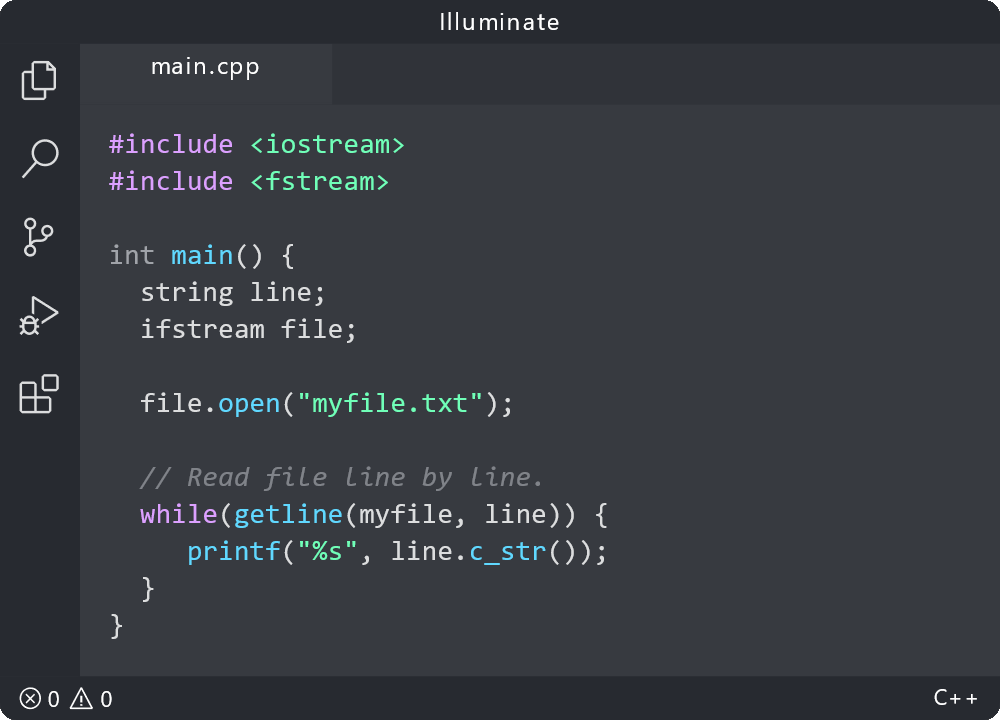

<!-- BANNER -->

# 

<!-- SHIELDS -->

<!-- DESCRIPTION -->

A color theme for Visual Studio Code. It uses all the scopes mentioned [here](https://code.visualstudio.com/api/references/theme-color).

<!-- PREVIEW -->

## Preview

<!-- COLORS -->

## Colors

All the colors used in this color theme can be found [here](resources/colors.md).

<!-- COMMENTS -->

## Comments

List of keywords that can be highlighted in a comment:

- TODO
- ADD
- CHANGE
- FIX
- REMOVE

<!-- CUSTOMIZE -->

## Customize

If you want to customize specific colors:

1. Visit the [VS Code Docs](https://code.visualstudio.com/api/references/theme-color) for the list of available scopes.
2. Identify the scope that corresponds to the color you wish to change.
3. Modify the value of that scope in `settings.json`.

<!-- LICENSE -->

## License

Distributed under the [MIT License](LICENSE).
